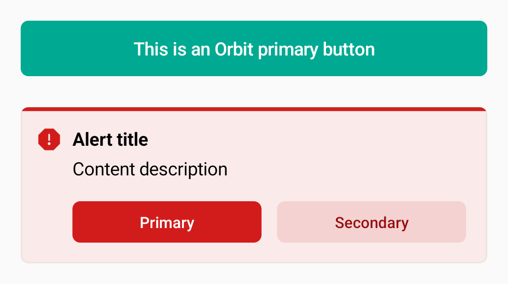

<div align="center">

<a href="https://orbit.kiwi" target="_blank">  
      
  </a>

**Orbit Compose**

[](https://code.kiwi.com)
[](https://github.com/kiwicom/orbit-compose/actions/workflows/build.yml)
[](https://github.com/kiwicom/orbit-compose/releases)
[](https://search.maven.org/search?q=g:kiwi.orbit.compose)
[](https://developer.android.com/jetpack/androidx/releases/compose-kotlin)
[](https://developer.android.com/jetpack/androidx/releases/compose-material3)

</div>

## About Orbit

[Orbit](https://orbit.kiwi) is an open-source design system that aims to bring order and consistency to
Kiwi.com products as well as the processes behind building them. It elevates the user experience and increases
the speed and efficiency of how we design and build products.

This library allows developers to implement Orbit in a project
using [Jetpack Compose](https://developer.android.com/jetpack/compose) for Android.

Orbit Compose builds upon Material 3 library. If you need an integration with Material 2, see
[Theming chapter](https://github.com/kiwicom/orbit-compose/blob/main/docs/02-foundation/04-color/theming.md).

## Setup

We publish our releases in [Maven Central](https://search.maven.org/search?q=g:kiwi.orbit.compose). To use
this library, you can add the following dependencies to your **Gradle file**:

```
implementation("kiwi.orbit.compose:ui:<version>")
implementation("kiwi.orbit.compose:icons:<version>")
implementation("kiwi.orbit.compose:illustrations:<version>")
```

## How to use?

In order to use one of Orbit's components, simply add them to your Composable function.

```kotlin
@Composable
fun MyScreen() {
    Column(
        verticalArrangement = Arrangement.spacedBy(8.dp),
        modifier = Modifier.padding(16.dp)
    ) {
        val maxWidth = Modifier.fillMaxWidth()
      
        ButtonPrimary(onClick = {}, maxWidth) {
            Text("This is an Orbit primary button")
        }
  
        Spacer(modifier = Modifier.padding(4.dp))
  
        AlertCritical(
            title = { Text("Alert title") },
            content = { Text("Content description") },
            actions = {
                ButtonPrimary(onClick = {}) { Text("Primary") }
                ButtonSecondary(onClick = {}) { Text("Secondary") }
            },
        )
    }
}
```

Colors, typography, and other foundational elements can be used by accessing the `OrbitTheme` object:

```kotlin
Text("Title 1", emphasis = ContentEmphasis.Minor)
Text("Big title in Title 1 style", style = OrbitTheme.typography.title1)
Text("Check your typography styles!", color = OrbitTheme.colors.warning.normal)
```

<table>
<tr>
<td>



<td>


</table>

### Icons and Illustrations

Icons and illustrations can be accessed in the same way, with the corresponding `Icons` and `Illustrations`
objects:

```kotlin
Image(painter = Illustrations.AppKiwi, contentDescription = "app_kiwi")
```

## Documentation

You can check out our component Catalog by downloading and installing
our [showcase application](https://play.google.com/store/apps/details?id=kiwi.orbit.compose.catalog) from Google
Play.

The [API documentation](https://kiwicom.github.io/orbit-compose/) lists
all possible types and composables in our library.

## Contributing

Read our [contributing guidelines](./contributing.md) to see how you can participate in this project.

## Feedback

Any feedback you have for us is appreciated. If you have any suggestions about what we can do, do not hesitate
to [report the issue](https://github.com/kiwicom/orbit-compose/issues) and we'll take a look at it.
